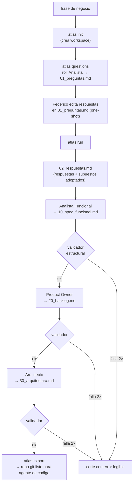

# Atlas — Arquitectura del MVP (Fase 2, Día 2)

- **Fecha:** 2026-07-06 · **Autor:** Fable (Claude Code) · **Valida:** Federico
- **Insumos:** `FUNCTIONAL_SPEC.md`, `examples/veterinaria/GOLDEN_CASE.md`, ADR-0001
- **ADRs de trade-offs asociados:** ADR-0002 (sin framework de agentes), ADR-0003 (Markdown como contrato), ADR-0004 (enrutamiento de modelos por rol)

## 1. Vista general

Atlas MVP es una CLI local en Python que corre un pipeline secuencial de tres roles LLM con validación estructural entre etapas. Sin servidor, sin base de datos, sin UI: el filesystem del workspace es el estado, y el output es un repo git.



## 2. Stack, justificado (una línea por elección)

| Elección | Justificación |
|---|---|
| Python 3.11+ | Ya validado y presente en ambas máquinas; sin runtime nuevo. |
| Orquestador propio, sin framework de agentes | 3 llamadas secuenciales no ameritan LangChain/CrewAI; ver ADR-0002. |
| SDKs oficiales `groq` y `anthropic` | Retries, timeouts y tipos resueltos por el proveedor; capa propia mínima encima. |
| `pydantic` + `pyyaml` | Validación tipada del frontmatter de artefactos (RN-4) sin validador artesanal. |
| Markdown + frontmatter YAML como artefactos | Legible por humanos y chequeable por máquina; el formato interno ES el output final; ver ADR-0003. |
| `argparse` (stdlib) para la CLI | 4 subcomandos no justifican Typer/Click como dependencia. |
| git como formato de entrega | El repo exportado se commitea; trazabilidad y diffs gratis. |
| Docker | Solo empaquetado post-MVP para el VPS (§8); no es requisito para correr. |
| n8n | **Fuera del MVP**: no hay triggers ni integraciones que lo justifiquen todavía. |

## 3. Componentes

```
atlas/
  cli.py           # argparse: init | questions | run | export
  orchestrator.py  # máquina secuencial de etapas, reintento único, reanudable
  roles/           # 1 plantilla de prompt por rol + binding a modelo (routing)
    analista.py    #   genera preguntas y spec funcional
    po.py          #   genera backlog priorizado
    arquitecto.py  #   genera propuesta de arquitectura
  validator.py     # pydantic (frontmatter) + headings obligatorios por tipo
  exporter.py      # arma el repo final, git init + commit inicial
  config.py        # lee atlas.toml (routing, límites); keys SOLO por env
```

- **Orquestador reanudable:** una etapa está completa si su artefacto existe y valida. Re-ejecutar `atlas run` retoma desde la primera etapa sin artefacto válido — no repite llamadas ya pagadas.
- **Roles = plantilla + modelo:** un rol es un prompt con slots (artefacto de entrada, contrato de salida) más una entrada en la tabla de routing. Agregar un rol post-MVP no toca el orquestador.

## 4. Modelo de datos

Sin base de datos: el workspace es el estado (CLI mono-usuario; una DB entraría recién con multi-tenant, post-MVP).

```
workspace/<slug>/
  state.yaml            # frase, timestamps, modelo usado por etapa, estado por etapa
  01_preguntas.md       # salida del motor de preguntas; Federico responde acá mismo
  02_respuestas.md      # consolidado: respuestas dadas + supuestos adoptados
  10_spec_funcional.md  # artefacto del Analista
  20_backlog.md         # artefacto del PO
  30_arquitectura.md    # artefacto del Arquitecto
  supuestos.md          # todos los supuestos no validados (US-08)
  out/                  # repo git exportado (atlas export)
```

Entidades lógicas y campos mínimos:

| Entidad | Campos | Vive en |
|---|---|---|
| Workspace | slug, frase, created_at, etapas[] | `state.yaml` |
| Pregunta | id, eje, texto, desbloquea, supuesto_default, riesgo, respuesta? | `01_preguntas.md` |
| Respuesta | pregunta_id, valor, origen (usuario \| supuesto_adoptado) | `02_respuestas.md` |
| Artefacto | tipo, role, model, schema_version, inputs (path+sha256), assumptions[] | frontmatter de cada `.md` |
| Supuesto | pregunta_id, texto, riesgo, artefactos_afectados[], validado (bool) | `supuestos.md` |

## 5. Contratos entre roles

Todo artefacto lleva el mismo frontmatter (validado con pydantic) y secciones obligatorias por tipo (validadas por headings). El rol siguiente consume **solo** el artefacto validado del anterior (RN-2).

```yaml
---
tipo: spec_funcional          # preguntas | respuestas | spec_funcional | backlog | arquitectura
schema_version: 1
role: analista
model: groq/llama-3.3-70b-versatile
inputs:
  - path: 02_respuestas.md
    sha256: "<hash>"          # si el input cambió, la etapa se invalida y se regenera
assumptions:
  - pregunta_id: P6
    texto: "sin migración de datos"
---
```

| Artefacto | Secciones obligatorias |
|---|---|
| `01_preguntas.md` | una sección por pregunta con los 6 campos del contrato (§3 de la spec) |
| `02_respuestas.md` | Respuestas · Supuestos adoptados |
| `10_spec_funcional.md` | Visión · Actores · Reglas de negocio · Historias de usuario (cada una con CA y traza a pregunta/supuesto) · Supuestos |
| `20_backlog.md` | Criterio de priorización · Items (cada uno con referencia a historia y prioridad) · Supuestos |
| `30_arquitectura.md` | Stack justificado · Modelo de datos · Contratos de API · Consistencia con restricciones · Supuestos |

**Regla de reintento (RN-4):** artefacto inválido → una regeneración con los errores del validador anexados al prompt → si vuelve a fallar, corte con error legible que nombra la sección faltante. Nunca se propaga un artefacto inválido.

## 6. Enrutamiento de modelos por rol (ADR-0004)

| Rol | Modelo default | Por qué | Fallback |
|---|---|---|---|
| Analista Funcional | `groq/llama-3.3-70b-versatile` | Generación con plantilla fuerte y contrato estricto; el validador ataja los errores | DeepSeek vía API |
| Product Owner | `groq/llama-3.3-70b-versatile` | Priorizar con criterio declarado es mecánico si las historias ya traen CA | DeepSeek vía API |
| Arquitecto | `claude-sonnet-5` (API Anthropic) | Único rol de criterio puro: trade-offs y consistencia con restricciones | modo degradado: Groq, marcado en el artefacto |
| Validador | — (no-LLM) | Determinístico y gratis; un LLM validando estructura es despilfarro | — |

Routing en `atlas.toml`, intercambiable sin tocar código. Sin `ANTHROPIC_API_KEY`, el pipeline corre completo en modo degradado (todo Groq) y lo deja marcado en el frontmatter — corre gratis, avisa qué calidad estás sacrificando.

## 7. Manejo de errores y reanudación

- Fallos de API (timeout, rate limit): reintentos del SDK; si se agotan, corte legible con la etapa y causa. `atlas run` posterior retoma desde ahí (§3).
- Cero respuestas del usuario: no es error — se adoptan todos los supuestos default (US-03) y `supuestos.md` queda como lista de riesgo.
- Artefacto inválido: regla de reintento del §5.

## 8. Diseñada para el VPS Oracle Free Tier (deploy real post-MVP, ADR-0001)

CLI stateless, sin puertos, Python puro → un `Dockerfile` slim multi-arch (el Free Tier es arm64) alcanza. Trigger remoto (cron o n8n) y publicación automática del repo generado quedan post-MVP. Nada en el diseño lo bloquea: no hay dependencias nativas ni estado fuera del workspace.

## 9. Seguridad y credenciales

Keys solo por variables de entorno (`GROQ_API_KEY`, `ANTHROPIC_API_KEY`); nunca en `atlas.toml`, en el workspace ni en el repo exportado (que sale con su propio `.gitignore`). Regla de credenciales de `CLAUDE.md` aplica sin excepción.

## 10. Plan de implementación — handoff a Sonnet/Aider (Día 3)

Orden ejecutable, sin decisiones abiertas; cada tarea cierra con algo corrible. El test de aceptación global es el golden case (§7 de la spec).

| # | Tarea | Implementa | Depende de |
|---|---|---|---|
| T1 | Scaffolding del paquete + `atlas init` | US-01 | — |
| T2 | Modelos pydantic de contratos + validador | RN-4, §5 | T1 |
| T3 | Rol Analista: generación de `01_preguntas.md` | US-02 | T2 |
| T4 | Ingesta de respuestas + adopción de supuestos → `02_respuestas.md` | US-03 | T2 |
| T5 | Rol Analista: `10_spec_funcional.md` | US-04 | T4 |
| T6 | Rol PO: `20_backlog.md` | US-06 | T5 |
| T7 | Rol Arquitecto: `30_arquitectura.md` (+ modo degradado) | US-05 | T5 |
| T8 | Exporter (`out/` con git init) + `supuestos.md` | US-07, US-08 | T5-T7 |
| T9 | Correr el golden case end-to-end y comparar estructura contra el fixture | cierre Día 3 | T1-T8 |

## 11. Supuestos tomados en este diseño (a validar por Federico)

| id | Supuesto | Impacto si es erróneo |
|---|---|---|
| S-D2-1 | P2 y P6 del golden case confirmados **en sus valores default** (el mensaje de validación traía placeholders sin completar) | Cambia el MVP del caso (P2) o la arquitectura del caso (P6) |
| S-D2-2 | Habrá `ANTHROPIC_API_KEY` disponible para el rol Arquitecto | Sin key: modo degradado all-Groq (previsto, §6), menor calidad en el artefacto de arquitectura |
| S-D2-3 | Federico responde preguntas editando `01_preguntas.md` directamente (no hay prompt interactivo en CLI) | UX distinta; agregar un `atlas answer` interactivo sería post-MVP |
| S-D2-4 | Modelos concretos: `llama-3.3-70b-versatile` y `claude-sonnet-5`, fijados en `atlas.toml` | Solo cambia config, no código |
| S-D2-5 | El repo generado se publica a GitHub manualmente (o con `gh` a mano) en el MVP | La publicación automática es una tarea post-MVP |
| S-D2-6 | Dependencias: `groq`, `anthropic`, `pydantic`, `pyyaml` — nada más | Agregar deps requiere justificación en ADR |

## 12. Post-MVP

Backlog explícito de ADR-0001 (Consecuencias) — ninguno de estos ítems es requisito de "funciona":

- Loop de descubrimiento interactivo (hoy es one-shot, recorte 1 del ADR-0001).
- UI (hoy es CLI pura).
- Multi-tenant (hoy es single-tenant, workspace local).
- Deploy a VPS Oracle Free Tier (recorte 2 del ADR-0001; §8 ya deja el diseño listo para esto, no bloquea nada).
- Casos de uso adicionales al de la veterinaria.
- Gestión de sprints y roles UX/QA/DevOps como agentes (fuera de alcance por §6 de `FUNCTIONAL_SPEC.md`).

Encontrado corriendo el golden case en el Día 3 (no es un recorte de alcance, es una limitación de calidad observada):

- **Preguntas del Analista siguen siendo genéricas pese al few-shot.** La iteración de calidad del Día 3 mejoró notablemente las historias de usuario (CA-1/CA-2/CA-3 en bullets, contenido de dominio) y los ítems del backlog (valor de negocio + dependencias explícitas), pero el mismo tratamiento sobre `PREGUNTAS_SYSTEM` no movió la aguja: el motor de preguntas (`atlas questions`) sigue generando preguntas más genéricas ("¿tamaño promedio de la clínica?") que las del golden case ("¿cuál es el proceso que más duele hoy?"). Por timebox no se iteró una segunda vez sobre este prompt específico. Queda pendiente una vuelta dedicada — probablemente necesita un enfoque distinto al few-shot (p. ej. forzar explícitamente la pregunta de "costo de omisión" como primer paso del razonamiento del prompt, no solo mostrar ejemplos de buena calidad).
